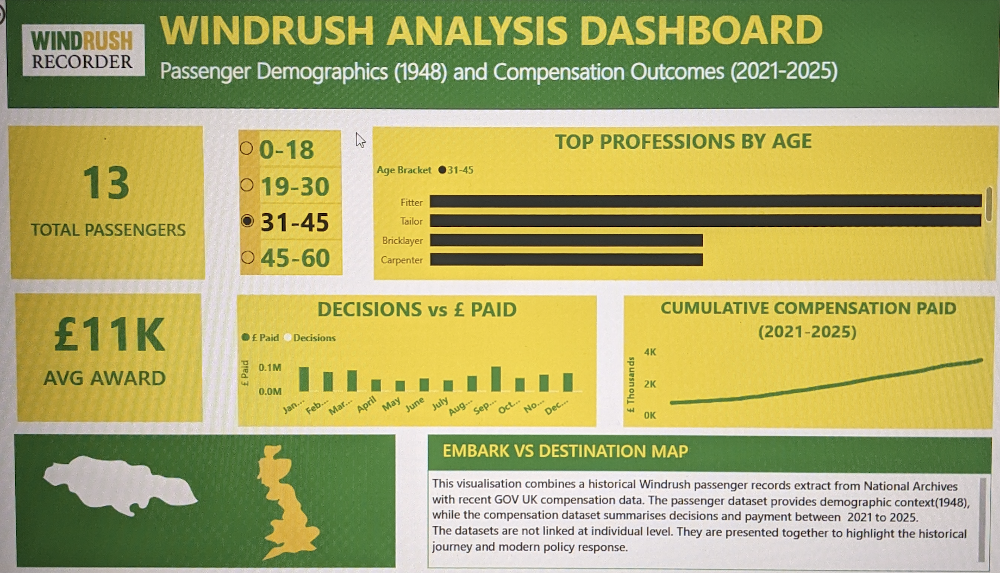
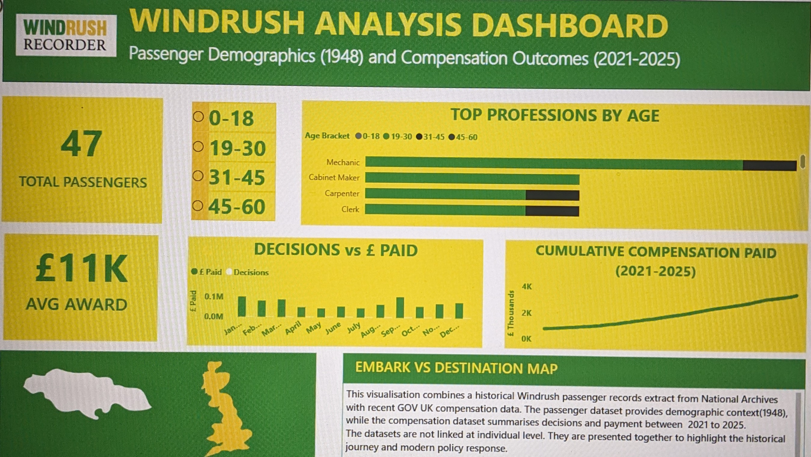

# Windrush Cohort & Compensation Analysis

_A Public Sector Data Analytics Pipeline (BigQuery + Star Schema)_

---

## Dashboard Preview




---

## Download Power BI /File

Upload the interactive dashboard locally:
[Download the .pbix file](dashboard/post_windrush.pbix)

---

## Project Presentation

- 🎥 **Slide Deck:** [View on Google Slides](Phttps://docs.google.com/presentation/d/1Wj0wQumH4pFNqweHjxNGePFbKdKUZNWPBXM5Sk4jzmw/edit?usp=sharing)

## Project Overview

This project transforms raw public datasets into a structured analytics warehouse to examine:

- Windrush-era population cohorts (ONS Census snapshot)
- Compensation scheme outcomes
- Demographic distribution across arrival cohorts

The objective is to compare estimated cohort size against approved and paid claims, analyse how compensation activity has evolved over time, and highlight gaps between policy intent and observed outcomes.

The solution demonstrates dimensional modelling, advanced SQL, and responsible handling of public demographic data.

---

## Visual Design

Colour choices were intentionally selected to reflect the Caribbean heritage of the Windrush generation, while mainitaining sufficient contrast for readability and accessibility.

---

## Research Question

How do compensation outcomes compare to the estimated Windrush-era population, and what trends are visible over time?

---

## Tech Stack

- Google BigQuery (UK region)
- SQL (CTEs, Window Functions, Aggregations)
- Power BI
- Git + VSCode

---

## Repository Structure

```text
├── README.md
├── data_modelling/
│   └── windrush_star_schema.png
├── sql_scripts/
│   ├── transformations/
│   ├── analysis/
│   └── compensation/
├── dashboard/
│   ├── summary.png
│   └── analysis.png
└── .gitignore
```

- `transformations/` → staging, dimension, and fact table creation
- `analysis/` → demographic and cohort analysis queries
- `compensation/` → compensation trend analysis

---

## Data Sources

- ONS Census (England & Wales, 2011 snapshot)
- GOV.UK Windrush Compensation Scheme monthly statistics
- National Archives digitised landing record sample (contextual reference)

### Data Limitations

- Census data represents a historical snapshot
- Compensation data is aggregated monthly (no claimant-level detail)
- No direct join exists between population and compensation datasets
- Landing records are not statistically representative

This analysis is observational and contextual, not causal.

---

## Data Model

A star schema was implemented in BigQuery to support scalable aggregation and dashboard performance.

### Fact Table — `fact_population`

**Grain:** One row per combination of:

- age_group
- ethnicity
- arrival_cohort

**Measure:**

- `population_count`

### Dimension Tables

- `dim_age`
- `dim_ethnicity`
- `dim_arrival_cohort`

### Design Decisions

- Surrogate keys generated using `GENERATE_UUID()`
- Strict grain enforcement to prevent double counting
- Separation between staging and dimensional layers
- BigQuery dataset configured in UK region

The dimensional structure enables scalable aggregation while preserving analytical flexibility for cohort-based comparisons and trend analysis.

---

## Data Transformation

Raw datasets were first loaded into staging tables in BigQuery before being modelled into a star schema.

Transformation steps included:

- Standardising column names and data types
- Removing zero-value and incomplete records
- Normalising categorical fields (age bands, ethnicity, arrival cohorts)
- Generating surrogate keys using `GENERATE_UUID()`
- Enforcing consistent fact table grain

Staging and dimensional layers were separated to maintain clarity and reproducibility.

---

## Key Insights

The following findings were derived from the dimensional model and validated through reproducible SQL queries.

### 1. Compensation Conversion Rate

- 9,184 claims approved
- 3,604 payments issued
- ~39% conversion rate

Query:  
`sql_scripts/compensation/04_total_approved_total_paid_percentage_paid.sql`

---

### 2. Monthly Payment Trend

Payments increased from ~20–30 per month (2021) to peaks above 80–100 per month (2024–2025).

Query:  
`sql_scripts/compensation/06_monthly_paid_increment.sql`

---

### 3. Claims vs Estimated Cohort Size

Approved claims represent just over ~1% of the estimated Windrush-era population.

Query:  
`sql_scripts/analysis/07_arrival_period_size_and_percentage_of_total.sql`

---

## SQL Techniques Demonstrated

- CTEs for modular transformations
- Controlled aggregation across defined grain
- Window functions for ranking and monthly trend analysis
- Dimensional joins across fact and dimension tables

All analytical queries are organised under:

- `sql_scripts/analysis/`
- `sql_scripts/compensation/`

---

## How to Run

### 1. Create BigQuery Dataset

- Set dataset location to **UK region**
- Upload raw CSV files into staging tables

### 2. Run Transformations

Execute:

`sql_scripts/transformations/`

This creates staging tables, dimension tables, and the fact table.

### 3. Run Analytical Queries

Execute:

- `sql_scripts/analysis/`
- `sql_scripts/compensation/`

### 4. Connect Dashboard

- Connect Power BI to BigQuery
- Build visuals from modelled tables
- Apply slicers for Age Bracket and Month

Dashboard flow:

**Summary → Trends → Context**

---

## Data Ethics Considerations

This project uses publicly available datasets and contains no personally identifiable information.

The Goldsmiths digitised landing records were used for contextual reference only. Due to licensing constraints, the dataset was not redistributed or structurally transformed within the warehouse model. Modelling decisions were adjusted to remain compliant with usage restrictions.

Compensation data is analysed at aggregate level only.

When analysing demographic disparities:

- Findings are presented with context
- Dataset limitations are clearly stated
- Aggregated statistics are interpreted cautiously

Public sector analysis requires careful communication to avoid misrepresentation of demographic patterns or policy impact.

---

## Public Service Implication

The analysis highlights the scale difference between the estimated Windrush-era population and approved compensation claims.

While this project does not assess causality, it provides a structured analytical foundation for further investigation into access, awareness, and administrative processing within the compensation scheme.

---

## Source Links

- ONS Census Dataset Builder: https://www.ons.gov.uk/filters/b39c683e-d158-4d09-bc54-14bf40bd0316/dimensions
- Windrush Compensation Statistics: https://www.gov.uk/government/statistics/windrush-compensation-scheme-data-september-2025
- National Archives Passenger Records: https://www.nationalarchives.gov.uk/education/resources/commonwealth-migration-since-1945/passenger-list-from-windrush/
